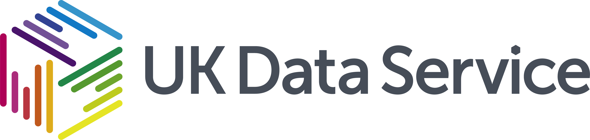

 
 
# Synthetic Data

In this free webinar series, we cover the advantages and disadvantages of synthetic data. We explore the variety of methods available to generate synthetic data. Finally, we discuss the nuanced definitions comprising synthetic data itself. 

## Code Demo

## Topics
The following topics are covered under this training series:
1. **What is Synthetic Data?** - The basic uses and features of Synthetic Data.
2. **Masking & Redaction** - We cover some basic techniques for synthesizing data, masking and redaction. 
3. **Coarsening, Mimicking & Simulation** - We cover the more advacned aspects of data synthesis.
4. **Code Demo**

## Materials

The training materials - including webinar recordings, slides, and sample Python code - can be found in the following folders:
* [reading-list](./reading-list) - explore further resources including articles, books, online resources and more.
* [webinars](./webinars) - watch recordings of our webinars and download the underpinning slides.
* [code-demo)(./code-demo) - follow along with a synthesis demo.

## Further Information

* To access learning materials from the wider *Computational Social Science* training series: <a href="https://github.com/UKDataServiceOpen/computational-social-science" target=_blank>[Training Materials]</a>
* To keep up to date with upcoming and past training events: <a href="https://ukdataservice.ac.uk/news-and-events/events" target=_blank>[Events]</a>
* To get in contact with feedback, ideas or to seek assistance: <a href="https://ukdataservice.ac.uk/help.aspx" target=_blank>[Help]</a>

Thank you and good luck on your journey exploring new forms of data!  

<a href="https://twitter.com/JosephAllen1234" target=_blank>Joseph Allen</a>
 
UK Data Service   
University of Manchester  
